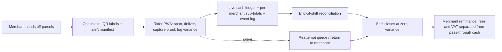

# Indek

### For UAE courier operators running multi-merchant cash-on-delivery with home-based riders, Indek is the chain-of-custody operations platform that makes every parcel and every dirham reconcile at the end of every day — without ever holding the operator's money.

## The problem

Small and mid-sized UAE courier operators run their fleets on WhatsApp, Excel, and trust. That works at three riders. It breaks at ten. The numbers underneath the pain are quietly brutal: COD still drives roughly **a third of UAE e-commerce orders**, and COD parcels fail at around **20%** versus 3% for prepaid — meaning every fifth COD parcel becomes a reverse-logistics problem that the operator absorbs as double shipping cost, double handling, and a frustrated merchant. On top of that, manual cash workflows leak an estimated **2–5% of collected COD** to variance that never gets traced.

- **Cash leaks silently and pools across merchants.** A rider running 20–30 deliveries a shift carries AED 1,500–5,000 in pocket cash collected on behalf of a dozen different merchants. There is no live view of who is holding how much for whom, no automatic reconciliation between delivered parcels and handed-in cash, and no per-merchant sub-ledger when the rider returns at end of day. The rider also carries a personal float for making change, which gets co-mingled with collections. Small losses compound into unprofitable months and merchant trust erodes.
- **Parcels fall through the cracks at three different points.** A rider marks something "delivered" in a WhatsApp message; nobody scans anything; the merchant disputes it two days later; nobody can prove what happened at the door. The same thing happens on rider-to-rider handoffs mid-shift, and again on the return path when failed parcels sit in the rider's bag for 3–7 days waiting for a reattempt that may or may not happen. Disputes are resolved by whoever shouts loudest.
- **Ops lives in spreadsheets and WhatsApp groups.** Assigning jobs, tracking rider status, calculating end-of-day pay, producing per-merchant remittance statements with VAT correctly separated from pass-through cash, and chasing reattempts on failed deliveries — all manual, every day, forever. The operator becomes a data-entry clerk to their own business and ends the day at midnight reconciling yesterday.
- **Addresses are landmark-based, units are invisible, and orders arrive in every format imaginable.** Makani and Onwani solve building-level addressing but not apartment-level — every delivery still depends on a Google Maps pin-drop, a phone call, and a WhatsApp live-location share. Failed first-delivery is the single largest hidden cost in UAE last-mile, and the most common root cause is "customer not home or not answering."

What it costs when it goes wrong: unrecovered COD, duplicate delivery attempts on the same parcel, retroactive deductions from merchant remittances that destroy trust, disputes that can't be won, riders leaving because payroll is opaque, and an operator whose tenth rider is the one that breaks the workflow entirely.

## The customer

The best early customer is the team building this: a small, owner-operated UAE courier doing multi-merchant COD parcel delivery with home-based riders.

- **Team type:** Operator-led courier, 3–20 riders, typically one or two ops people (often the founder). Holds a mainland DED trade license with courier activity codes plus RTA delivery permits. Sponsors riders on company employment visas at AED 3,000–7,500 per rider in setup costs.
- **Environment:** UAE (Dubai / Sharjah / Abu Dhabi), home-based riders with no depot, two-wheelers (150cc+, 20kg cargo limit, fixed delivery box per RTA spec), multi-merchant pickups, dominant COD payment, summer midday delivery ban (12:30–3:00 PM, June 15–September 15) eats 2.5 hours of daily capacity for three months a year.
- **Merchant mix:** 5–30 small merchants — Instagram boutiques, home bakers, perfume sellers, pharmacies, small e-commerce stores. Merchants send orders via WhatsApp, Google Sheets, or a Shopify export. They expect daily WhatsApp status pings and weekly itemized remittance.
- **Current workaround:** WhatsApp groups for dispatch, Excel sheets for cash, paper slips or photos for proof of delivery, phone calls for exceptions, end-of-week scramble for merchant remittance.
- **Buying motivation:** Cash leakage, dispute losses, ops time cost, the fear of the tenth rider, and the slow erosion of merchant trust caused by remittance delays and unexplained variance.
- **Why they switch now:** Their current workflow cannot survive a doubling of fleet size, and they know it. The summer midday ban and tightening rider regulations (mandatory health insurance, lane restrictions, 8,000+ rider fines per month in Dubai) make operational discipline a survival requirement, not a nice-to-have.

## The product thesis

Indek replaces the WhatsApp-and-Excel operation with three tightly coupled capabilities, plus one explicit non-capability that defines the legal posture of the entire product.

1. **Chain of custody for every parcel and every custody transfer.** Every state transition — pickup, in-transit, attempted, delivered-to-recipient, delivered-to-concierge, failed, in-return, returned-to-merchant — is an immutable event with rider identity, timestamp, geolocation, photo, and (where applicable) a customer OTP. Critically, **rider-to-rider handoffs** and **partial deliveries** are first-class events too: nothing transfers between people without a logged, both-party-acknowledged custody event, and a parcel where the customer kept two of three items splits cleanly into a delivered portion and a returned portion. Disputes become queries against an append-only event log.
2. **Closed-loop cash reconciliation with per-merchant sub-ledgers.** Every rider has a live cash ledger that tracks (a) COD collected per parcel, per merchant, (b) the rider's personal float for making change, (c) inter-rider cash transfers, and (d) drops to the operator. Every COD line carries both an `expected amount` and an `actually collected amount` with a `variance reason` — because partial acceptance, exact-change shortfalls, and at-door price negotiations are routine, not exceptions. End-of-shift cannot close until parcels in custody equal zero and cash variance equals zero (or ops explicitly writes off a variance with a reason code). **Merchant remittance is computed from the same ledger, with delivery fees and COD handling fees correctly separated from pass-through cash for VAT purposes.**
3. **A single operations control plane that selectively replaces WhatsApp.** One admin system for intake, dispatch, reconciliation, RTO management, and reporting. One merchant view for parcel status and COD balance. One rider mobile experience for scanning, delivering, capturing proof, and closing the day. WhatsApp stays — but only as a notification channel for merchants and customers, not as the system of record. The critical path (assignment, status, cash, proof) lives in Indek.
4. **Indek never holds the operator's money — and never holds the merchants' money.** This is not a feature; it is a constitutive constraint. Indek is a logistics and reconciliation platform, not a payment processor or stored-value facility. Cash flows physically from rider to operator to operator's bank account to merchant; Indek records every step but never sits in the middle of the funds flow. This posture keeps Indek outside the scope of CBUAE retail-payment-services and stored-value-facility licensing, and it must be defended in every product decision.

## Core user/value loop

1. A merchant hands the operator a batch of parcels (or sends an order list via WhatsApp, Google Sheet, or Shopify export). Ops intakes them, prints QR labels, and assigns them as a **shift manifest** to an available rider from the dispatch board.
2. The rider accepts the manifest on their phone, scans parcels at the merchant pickup, delivers each one with a photo and — for COD — a customer OTP, and watches their cash ledger update in real time with per-merchant sub-totals. When a customer keeps only part of an order, the rider records the split at the door; when a customer isn't home, the rider records a failed attempt with reason code and the parcel enters the reattempt queue.
3. At end of shift, the rider hands cash to ops with a single drop event and surrenders any undelivered parcels with a custody transfer event. The system reconciles parcels, cash, and hours, and closes the shift only when everything matches. Ops goes home on time. Merchants see their per-order status and accumulating COD balance throughout the day via a status link, and receive an itemized remittance statement on the agreed cycle.

## Optional text-native sketch

## Why now

- **Market shift.** UAE last-mile is a ~$1.3B market growing at roughly 8% CAGR on the back of e-commerce and social commerce. UAE social commerce alone is projected to nearly double from $3.21B (2024) to $6.41B (2030), with 71% of UAE social media users buying directly through social platforms. These orders flow through Instagram DMs and WhatsApp messages — exactly the merchants the small couriers serve. COD is ~31.6% of orders and isn't going away soon, and its 20% RTO rate is a direct, measurable cost that no platform serving small operators treats as a first-class problem.
- **Workflow pressure from regulation.** Recent UAE regulations are squeezing operational margin: mandatory worker health insurance (January 2025), the summer midday ban (eats 2.5 hours/day for three months), motorcycle lane restrictions (70,000+ violations in nine months at AED 500–700 each), and intensifying enforcement of cargo and route rules. Operators who don't have systematic visibility into rider activity get hit with these costs and can't trace them to the underlying behavior.
- **Competitive whitespace.** The closest comparable platform is Shipox (UAE-based, has a COD module, but with documented quality and integration issues and not built around home-based riders). Mile and iCargos serve adjacent geographies with COD-first thinking but neither is UAE-native or built for the sub-20-rider home-based segment. Fleet management platforms (Fleetroot, SuiteFleet) and global last-mile platforms (Onfleet, Locus, LogiNext) treat COD as a checkbox or ignore it entirely. **The gap is real: no platform serving small UAE operators treats COD cash as a first-class domain aggregate with rider-level ledger, real-time variance detection, and automated merchant remittance.**
- **Build economics.** A solo operator with modern tooling (TypeScript monorepo, managed Postgres, PWA, autonomous agentic coding) can ship a vertically integrated internal tool in weeks, not quarters. The cost of owning the stack has collapsed to the point where an internal-first build is the fastest path to validation.

## What makes the product different

- **COD-native, not bolted on.** Cash is a first-class aggregate with its own invariants, its own reconciliation screen, per-merchant sub-ledgers, and explicit handling of expected-vs-actual variance. Every other fleet SaaS treats cash as a field on a parcel.
- **Built around home-based riders, no depot, and multi-merchant pooling.** The shift manifest, the cash drop flow, the rider-to-rider handoff event, and the dispatch board all assume riders start and end their day wherever they are and carry parcels for many merchants in the same bag. Competitors assume a warehouse and a single shipper.
- **RTO is a first-class workflow, not an exception path.** Roughly one in five COD parcels comes back. Indek treats the reattempt queue and the return-to-merchant flow as core lifecycles with their own state machine, not as an afterthought.
- **Event-sourced audit trail by default.** Every state transition — including custody transfers between riders, partial deliveries, and concierge handoffs — is an immutable, queryable event with rider, geo, timestamp, and proof attached. Disputes are resolved by looking at the log, not by asking who remembers what.
- **Legally a SaaS tool, never a payment processor.** Indek records cash movements but never holds funds. This is what makes the product shippable in the UAE without a CBUAE license, and it shapes every design decision.

## Representative example and non-example

- **Best-fit example:** A Dubai-based courier with eight home-based riders picking up from a dozen small merchants (home bakers, boutique e-commerce, pharmacies) and delivering COD parcels across the city. Currently running on three WhatsApp groups and a shared Google Sheet. Loses two to three percent of COD revenue every month to unrecovered variance, has lost two merchants in the last quarter to remittance disputes, and dreads summer because the midday ban combined with manual reconciliation pushes ops past midnight every day.
- **Why it fits:** Small enough that the operator feels every dirham of leakage; big enough that manual reconciliation is already painful; COD-heavy and multi-merchant enough that the cash ledger and the per-merchant sub-totals earn their keep from day one.
- **Non-example:** A hyperlocal food delivery platform doing thousands of sub-thirty-minute orders per day with surge-based dynamic dispatch.
- **Why it is intentionally out of scope:** That problem shape needs real-time routing optimization, a driver marketplace, and sub-minute ETAs. Indek is built for scheduled parcel delivery where chain of custody and cash reconciliation matter more than routing latency.

## Non-goals

- Route optimization, live GPS tracking, or ETA prediction in v1
- A customer-facing tracking portal in v1 (a hosted status page link delivered over WhatsApp is enough)
- Holding, pooling, or processing funds in any digital form — ever, at any version
- AI-powered features (address resolution, merchant intake parsing, voice logging, photo verification) deferred to v2
- Multi-language UI in v1 — English only at launch (the South Asian rider workforce and the social-commerce merchant base both work in English; Arabic arrives when a second operator with Emirati merchants comes on)
- Dynamic pricing or per-kilometer charges in v1 (flat, manually entered charges per merchant agreement only)
- A public API or third-party integrations in v1 (Shopify and WooCommerce import deferred to v2)
- Native iOS or Android apps in v1 (PWA only, with Capacitor as a later escape hatch)
- Replacing WhatsApp as the merchant and customer notification channel — Indek sends notifications *through* WhatsApp, it does not try to move merchants off it

## Success signals

- **Customer (rider and merchant) outcome:** Failed-delivery rate trends down delivery over delivery; rider disputes drop to near zero because the event log answers every question; merchants stop asking "where's my money?" and remittance statements arrive on schedule, itemized correctly, with VAT on the right line.
- **Operator outcome:** End-of-shift reconciliation takes minutes instead of hours; ops stops using WhatsApp for dispatching and uses it only for customer-facing notifications; the fleet scales past ten riders without a linear increase in ops headcount; the operator survives a summer without the midday ban breaking the workflow.
- **Business outcome:** COD variance approaches zero; the internal tool is proven load-bearing for the real business; architecture is clean enough — and the legal posture defensible enough — to onboard a second operator as an external tenant without a rewrite and without a regulatory conversation.

## Risks and open questions

- **Risk:** The no-depot cash drop flow has no obviously correct physical answer. In-person handoff, CDM deposit by the rider directly, and operator-to-bank deposit each have tradeoffs, and the wrong default will create friction with riders. The choice also has legal implications — if the rider deposits directly to the operator's account via a CDM, the proof artifact (deposit slip) becomes part of the chain of custody.
- **Risk:** Riders may resist using a PWA over WhatsApp for logging outcomes, especially in the first weeks. Adoption is a training and UX problem, not a technology problem — and the rider workforce has limited smartphone literacy on average.
- **Risk:** The CBUAE regulatory line is bright but not infinitely far away. Any feature that makes Indek *feel* like a payment platform — a digital wallet for riders, a "hold" on COD funds, an instant-remittance loan product — could pull the platform into stored-value-facility or payment-aggregation licensing scope. Every product decision must be tested against this constraint.
- **Risk:** Validating the product on a single internal fleet may hide assumptions that don't generalize to a second operator, particularly around merchant agreement variability (remittance cycles, COD fee percentages, dispute windows, RTO cost allocation are all per-contract).
- **Risk:** The visa-sponsorship coupling between operator and rider is a power asymmetry the product cannot ignore. Features around rider pay, deductions for cash shortages, and termination workflows need careful design to avoid building tools that enable abuse.
- **Open question:** What is the default cash drop mechanism in v1, and what proof artifact does it produce? The leading candidates are (a) in-person rider-to-ops handoff with photo + signature, (b) rider direct CDM deposit with slip upload, and (c) operator-led collection from rider home with logged visit.
- **Open question:** How does Indek model the merchant agreement? It needs to be a configurable entity covering remittance cycle, COD handling fee percentage, accepted PoD methods, dispute window, RTO cost allocation, and per-merchant rider instructions — but in v1 it might just be a structured document attached to the merchant record.
- **Open question:** What signal tells us we're ready to onboard a second operator as the first external tenant, and what does that onboarding look like?
- **Open question:** Which v2 AI feature earns its place first — messy address resolution, arbitrary-format merchant intake parsing, or photo-PoD verification — and what's the data we need to collect in v1 to make v2 work?
- **Open question:** How does Indek handle the partial-delivery and at-door-renegotiation cases at the *interface* level? The data model is clear (expected vs. actual COD with variance reason); the rider UX is harder because the rider is standing at a door with an impatient customer.

## Handoff to downstream docs

- Business scope and fixed decisions go in `docs/product/01-prd.md`.
- Domain language, bounded contexts, aggregates, state models, and invariants go in `docs/product/02-ddd.md` — including the parcel lifecycle, the RTO lifecycle, the rider cash ledger, the shift manifest, the merchant remittance context, and the custody transfer event model.
- User-visible workflows go in `docs/product/03-ux.md`.
- Runtime and implementation constraints go in `docs/product/04-tech.md`.
