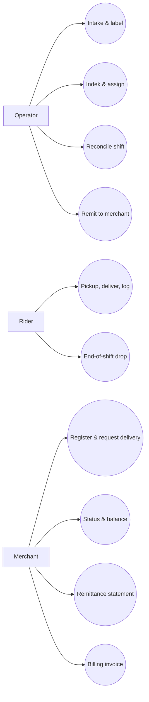

# Indek — Product Requirements Document

## 1. Purpose

This document is the business contract for Indek v1. It decides who the product is for, what it must do, what it explicitly will not do, and which decisions are fixed and not up for re-litigation during implementation.

It is not the place for domain modeling (aggregates, state machines, invariants — those live in `02-ddd.md`), screen-by-screen workflows (those live in `03-ux.md`), or technology choices (those live in `04-tech.md`). When in doubt, this document answers "what are we building and what are we deliberately not building," and the downstream documents answer "how."

- **Who it is for:** Small UAE courier operators (3–20 home-based riders) running multi-merchant cash-on-delivery parcel delivery, currently operating on WhatsApp and Excel.
- **What it solves:** Cash leakage, dispute losses, ops time cost, and remittance trust erosion — the four failure modes that prevent these operators from scaling past their tenth rider.
- **What is in scope:** Chain of custody, cash reconciliation, merchant approval, merchant remittance generation, merchant billing invoices, and the operator-rider dispatch loop.
- **What is fixed:** Indek never holds funds. Indek is internal-first. Indek is PWA-only and English-only at v1. Merchant request entry happens inside Indek, operator review is required before dispatch, and WhatsApp is not part of the v1 product workflow.

## 2. Product goal

Indek makes every parcel and every dirham reconcile at the end of every shift, for a small UAE courier running multi-merchant COD with home-based riders, without ever sitting in the path of the money. The operator should be able to close the day in minutes instead of hours, defend any dispute with an event log, and remit to merchants on a predictable cycle with VAT correctly separated from pass-through cash.

- Replace the manual request-intake and dispatch loop with a single ops control plane for review, assignment, status, and reconciliation.
- Make COD cash a first-class object with a per-rider, per-merchant ledger that closes to zero (or to an explicitly justified variance) at every shift end.
- Make every parcel state transition — including the messy ones (partial delivery, concierge handoff, rider-to-rider transfer, return-to-merchant) — an immutable event with rider, time, place, and proof.
- Survive the operational doubling of the fleet from 5 to 10 riders without a corresponding increase in ops headcount or a slip in merchant trust.

## 3. Primary users

### Operator (founder, ops lead)

The owner-operator or their ops person. Runs intake, dispatch, reconciliation, and merchant remittance. Currently lives in three WhatsApp groups and a Google Sheet, ends every day reconciling yesterday.

- **Needs:** A clean request-review queue; fast operator review and follow-up on bad requests; a visual dispatch board showing rider availability and load; live view of cash held per rider per merchant; one-screen end-of-shift reconciliation with rider cash drop; clean merchant remittance statements; merchant billing invoices; defensible dispute evidence; route-aware fee math; tax breakdowns; CSV exports; and one finance module for the money work.
- **Authority or risk-sensitive actions:** Assigning manifests to riders; closing shifts; writing off cash variance with reason codes; approving or rejecting merchant registrations; creating, deactivating, and removing rider access; generating and sending merchant remittance; issuing merchant billing invoices; sending finance emails; and resolving disputes. The operator is the only role that can write off variance, override a custody event, manage rider access, approve merchants, or send finance documents.

### Rider

A home-based delivery rider on a company-sponsored employment visa, riding a 150cc+ motorcycle with a fixed delivery box. Picks up parcels from multiple merchants in a shift, delivers them across the city, collects COD cash, and hands cash + undelivered parcels back to ops at end of shift. Smartphone literacy is variable; English fluency is variable.

- **Needs:** A simple PWA that works on a budget Android phone, tolerates spotty connectivity, requires few taps per delivery, and gives the rider a live view of their own cash float and parcels in custody.
- **Authority or risk-sensitive actions:** Marking a delivery as completed (with proof), recording variance at the door (partial acceptance, exact-change shortfall, customer renegotiation), recording a failed attempt with reason, accepting a custody transfer from another rider, dropping cash and parcels back to the operator. Riders cannot self-register, cannot edit history, cannot override variance reasons after the fact, and cannot mark a delivery as complete without the required proof artifact.

### Merchant

A small UAE business — Instagram boutique, home baker, perfume seller, pharmacy, small e-commerce store — handing 5 to 100 parcels a week to the operator. Sends orders via WhatsApp, Google Sheet, or occasionally a Shopify export. Wants live status visibility, predictable itemized remittance, and clear service billing.

- **Needs:** A lightweight request surface inside Indek; a pending-approval state after registration; a signed-in merchant workspace once approved; a running view of request status; a clear follow-up path when ops needs more information; clean remittance statements; clear service billing invoices; and clear separation of delivery fees and COD pass-through cash for their own VAT records.
- **Authority or risk-sensitive actions:** Merchants can register and, once approved, can access merchant views and submit requests. Merchants do not approve themselves, do not manage agreements, do not manage finance rules, and do not send finance documents. Merchant onboarding, agreement configuration, and dispute initiation remain operator-mediated in v1.

### Access and approval model

Roles remain:

- `operator`
- `merchant`
- `rider`

No `writer` role exists.

Merchant access states are:

- `pending_approval`
- `approved`
- `rejected`
- `suspended`

Rider access is admin-managed only. Riders do not self-register.

| Capability                                 | Operator | Merchant                                          | Rider |
| ------------------------------------------ | -------- | ------------------------------------------------- | ----- |
| Approve or reject merchant registration    | Yes      | No                                                | No    |
| Create, deactivate, or remove rider access | Yes      | No                                                | No    |
| Create delivery requests                   | Yes      | Yes, once approved or through merchant token flow | No    |
| Run dispatch and assign manifests          | Yes      | No                                                | No    |
| Generate remittance statements             | Yes      | No                                                | No    |
| Issue merchant billing invoices            | Yes      | No                                                | No    |
| Send finance emails                        | Yes      | No                                                | No    |
| View merchant finance documents            | Yes      | Yes, once approved                                | No    |

## 4. Product principles

1. **Cash and custody are first-class, not fields.** Every screen, every event, every aggregate in the system is built around the idea that a parcel and a dirham are the things being tracked — not a "shipment record" with cash as an attribute.
2. **Nothing closes until it reconciles.** A shift cannot close with parcels still in custody or cash variance unexplained. The system refuses ambiguity by default; the operator can override, but the override is itself an event with a reason.
3. **The event log is the source of truth.** No status is real unless it has an event behind it. Disputes are queries against the log, not arguments about who remembers what.
4. **Indek records money; it never holds money.** Cash flows physically from rider to operator to bank to merchant. Indek logs every step but is never an account, a wallet, or a holder of funds. This principle is what makes the product legal in the UAE without a Central Bank licence, and it overrides every feature request that would compromise it.
5. **Indek owns the workflow; external channels are optional.** Merchant request entry, operator review, dispatch, rider status, and finance all live inside Indek. v1 does not depend on WhatsApp. When Indek sends something outbound, it is a narrow transactional communication, not a chat product.
6. **Build for the tenth rider, not the third.** Every workflow is designed to survive a doubling of fleet size without a doubling of ops effort. If a feature only works at three riders, it does not ship.

## 5. Fixed product decisions

### Decision 1: Indek never holds, pools, or processes funds

- **What is fixed:** No digital wallet, no holding account, no instant remittance, no rider top-ups, no merchant escrow, no card processing, no payment links. Indek records cash movements that happen physically and through the operator's existing bank account; it is never in the funds flow itself.
- **Why it is fixed:** The CBUAE Retail Payment Services and Card Schemes regulation defines "Payment Aggregation Service" as facilitating merchants to accept payments, pooling them, and transferring them after a time period — which describes a courier operation almost exactly. Stored Value Facility licensing has its own thresholds. Indek is shippable as a logistics SaaS tool; it is not shippable as an unlicensed payment platform.
- **Tradeoff it creates:** Indek cannot offer "pay your rider instantly" or "advance the merchant their COD" features that would be commercially appealing. Every feature request that smells like a financial product gets tested against this constraint and most will fail it.

### Decision 2: Internal-first, single tenant at launch

- **What is fixed:** v1 is built and validated against exactly one courier operation — the team building it. The architecture is designed to be multi-tenant later, but v1 ships as a single-tenant deployment with no tenant onboarding, no SaaS subscription billing, and no tenant isolation work. Merchant public registration inside that single tenant is now in scope, but every merchant still requires operator approval before access is enabled.
- **Why it is fixed:** The team building Indek is also the first customer. This is the fastest path to validation and the only way to know whether the model survives contact with real riders, real merchants, and real cash. A second tenant is a v2 problem.
- **Tradeoff it creates:** Some assumptions baked into v1 will turn out to be specific to the founding operator and will need rework before a second tenant can be onboarded. This is acceptable — and surfacing those assumptions is one of the goals of v1.

### Decision 3: PWA only, English only, no native apps

- **What is fixed:** The rider client is a Progressive Web App. No iOS or Android native build at v1. UI is English only.
- **Why it is fixed:** PWA is fast to build, fast to update, and works well enough on a budget Android with offline-tolerant design. The rider workforce is predominantly South Asian and works in English; the social-commerce merchant base is predominantly English-using. Arabic is a v2 problem that arrives with the first Emirati-merchant-heavy operator.
- **Tradeoff it creates:** Some rider UX patterns that would be easier with native APIs (background sync, push notifications, camera control) will be more constrained. Capacitor remains the escape hatch if PWA limits become blockers.

### Decision 4: No WhatsApp integration in v1; communications stay narrow and transactional

- **What is fixed:** Merchant requests are created inside Indek. Operators review those requests inside Indek. If an operator needs clarification, they send a simple merchant follow-up message tied to the request. WhatsApp is not integrated into v1. Transactional email remains limited to account, approval, and finance documents.
- **Why it is fixed:** This keeps the first product loop simpler: one place to create requests, one place to review them, one place to dispatch them. It avoids integrating a chat channel before the operational workflow itself is stable.
- **Tradeoff it creates:** Operators may still use their own phone or ad hoc channels outside the system in edge cases, but Indek itself does not try to mirror or sync those conversations. The v1 product only supports lightweight request-scoped follow-up, not full messaging.

### Decision 5: Multi-merchant pooling and home-based riders are the assumed model

- **What is fixed:** Riders carry parcels for many merchants in a single shift. There is no depot. The rider's day starts and ends wherever they are. Cash is pooled in the rider's bag but reconciled per merchant. The shift manifest is the unit of assignment.
- **Why it is fixed:** This is the reality of the target customer. A platform that assumes single-shipper or assumes a depot is solving a different problem.
- **Tradeoff it creates:** The data model is more complex than a single-shipper system. Per-merchant sub-ledgers, multi-pickup manifests, and merchant agreement variability all become first-class concerns from day one.

### Decision 6: Route-aware pricing and tax math are in scope; live pricing is not

- **What is fixed:** Merchant agreements may carry route or zone-based delivery charges, COD handling fees, optional surcharges, and tax treatment that finance must calculate correctly. These are configured by the operator and applied by rule at review, reconciliation, remittance, and billing time. Real-time distance pricing, surge pricing, and routing-engine pricing are still out of scope.
- **Why it is fixed:** The admin finance workflow needs to reflect how the business actually charges: different delivery routes may carry different fees, and VAT/tax treatment must be explicit in every finance document and export.
- **Tradeoff it creates:** The finance model becomes more detailed earlier. The product must support route-aware fee tables and exportable finance data before it worries about optimization or live pricing.

### Decision 7: Route optimization, live GPS, and customer-facing tracking are out of v1

- **What is fixed:** No routing engine, no live GPS streaming, no customer tracking portal. The dispatch board shows rider status (available, on-shift, returning) and assigned manifest, not real-time location.
- **Why it is fixed:** These are expensive to build, expensive to operate, and not what makes the difference between a working operation and a broken one for the target customer. Cash and custody are.
- **Tradeoff it creates:** Some merchants and customers will ask "where is my parcel right now?" and the answer in v1 is "out for delivery in [zone]," not a moving dot on a map.

## 6. MVP scope

### In scope

- **Order intake:** Merchant request entry inside Indek as the default path, plus manual operator intake as a backoffice fallback. QR label generation and printing remain supported.
- **Access and approval:** Public merchant registration within the current tenant; merchant approval queue with `pending_approval`, `approved`, `rejected`, and `suspended` states; admin-controlled rider access lifecycle with create, deactivate, reactivate, and remove actions.
- **Merchant management:** Merchant records with agreement parameters (route or zone-based delivery fees, COD handling fee, tax treatment, remittance cycle, accepted PoD methods, dispute window, RTO cost allocation rule).
- **Dispatch board:** List of available riders, list of unassigned orders, drag-or-tap assignment to a rider as a shift manifest.
- **Rider PWA:** Manifest acceptance, parcel scanning at pickup, per-stop delivery flow with photo and OTP capture, variance recording at the door (partial acceptance, exact-change shortfall, customer renegotiation, refusal), failed-attempt recording with reason codes, custody transfer to another rider, end-of-shift cash and parcel drop.
- **Cash ledger:** Live per-rider, per-merchant sub-ledger updating on every confirmed delivery; rider personal float tracked separately from collections; variance highlighted in real time.
- **End-of-shift reconciliation:** Single screen showing parcels expected vs. parcels accounted for, cash expected vs. cash dropped, per-merchant breakdown, variance with required reason code to close.
- **RTO and reattempt queue:** Failed deliveries enter a reattempt queue; after the configured attempt limit (default 3), they enter a return-to-merchant flow with custody tracking back to the merchant.
- **Finance module:** An admin-only money hub for reconciliation, COD drop and rider cash handover, remittance, billing invoices, tax math, CSV exports, and finance email history.
- **Merchant remittance:** Auto-generated itemized statements per merchant per cycle, with route-aware delivery fees, COD handling fees, taxes, and pass-through COD cash clearly separated; remittance is computed by Indek but executed by the operator outside the system (bank transfer, cheque, cash).
- **Merchant billing invoices:** Auto-generated or operator-prepared invoices for merchant service charges, kept separate from remittance and tracked through issue, send, and paid/void states, with tax and route-level line items where needed.
- **Finance email:** Transactional email sending for account and approval notices, remittance statements, and billing invoices, with durable outbox status.
- **Finance exports:** CSV exports for reconciliation, COD drop, remittance, billing, and tax reporting.
- **Merchant status view and approved merchant workspace:** A hosted token page per merchant showing parcel status and accumulating COD balance, plus an approved signed-in merchant workspace for request entry and finance document visibility.
- **Request review workflow:** Operator-side due diligence on every merchant request, with the ability to approve it for dispatch or send the merchant a simple follow-up message from inside Indek.
- **Event log:** Immutable, queryable record of every state transition with rider, timestamp, geolocation, and proof artifact references. Operator-facing dispute view that surfaces the relevant log slice for any parcel.

### Out of scope

- Holding, pooling, processing, or advancing funds in any form
- Route optimization, live GPS tracking, ETA prediction
- Customer-facing tracking portal
- Rider payroll calculation, salary disbursement, or pay-slip generation
- Merchant self-service agreement editing or finance-rule editing
- AI features: address resolution, intake parsing, photo verification, voice logging
- Multi-language UI (English only; Arabic deferred)
- Public API or third-party integrations (Shopify, WooCommerce, accounting software)
- Native iOS or Android apps
- Live dynamic pricing, per-kilometer pricing, and surge pricing
- Multi-tenant architecture with tenant onboarding, SaaS subscription billing, or self-serve tenant provisioning
- Real-time chat between operator and rider
- End-customer account or login of any kind

### Explicitly unsupported combinations or edge cases

- **A delivery marked complete without a proof artifact.** Every delivered status requires the configured proof for that merchant agreement (photo, OTP, photo + OTP). No exceptions.
- **A shift closed with unexplained variance.** The operator may write off variance, but the write-off requires a reason code and is itself a logged event. Silent closing is impossible.
- **Cash transfer between riders without a custody transfer event.** If two riders need to swap parcels or cash mid-shift, the swap goes through a logged transfer with both-party acknowledgment. Informal handoffs are unsupported.
- **Editing history.** No event in the log can be edited or deleted. Corrections happen by appending compensating events.
- **A merchant agreement that mixes prepaid and COD on the same parcel.** v1 treats every parcel as either fully COD or fully prepaid; split-payment parcels are unsupported.
- **Same-rider continuous shifts spanning the summer midday ban window.** The system warns when a manifest's expected delivery times overlap the 12:30–3:00 PM ban (June 15–September 15) but does not enforce a hard block in v1.
- **Cross-emirate manifests with mixed merchant agreements.** v1 supports cross-emirate deliveries but assumes a single rider for a single shift; multi-rider relay across emirates is unsupported.

## 7. Capability areas

- **Intake and labeling:** Get merchant requests into the system, attach a scannable label when needed, and make them ready for review and assignment.
- **Access and approval:** Let merchants register, hold them in approval states until the operator approves them, and keep rider access fully operator-admin controlled.
- **Request review and follow-up:** Let the operator review every merchant request, perform due diligence, and either move it to dispatch or send a follow-up message back to the merchant.
- **Assignment and dispatch:** Match available riders to unassigned orders as shift manifests; surface rider load, current custody, and availability.
- **Field execution:** Give the rider a low-friction PWA for picking up, delivering, capturing proof, and recording variance; tolerate poor connectivity.
- **Finance operations:** Run reconciliation, COD drop, remittance, billing invoices, tax calculation, CSV exports, settlement recording, and finance email delivery from a single admin finance module.
- **Cash custody and reconciliation:** Maintain the rider cash ledger with per-merchant sub-totals; record each rider cash drop at end of day; close shifts with zero variance or explicit write-off; produce the audit trail.
- **Returns and reattempts:** Manage the lifecycle of failed deliveries from first failed attempt through reattempt queue to return-to-merchant custody handover.
- **Merchant remittance:** Compute itemized statements per merchant per cycle with correct VAT separation; make it easy for the operator to execute payment outside the system.
- **Status visibility:** Give merchants token-based status plus an approved signed-in merchant workspace for parcels, remittance, and billing visibility; give the operator a real-time picture of the whole operation.
- **Audit and dispute support:** Make the event log queryable; surface the relevant slice for any parcel or any reconciliation discrepancy.

## 8. Use case sketch

## 9. High-signal decision tables

### Closing a shift

| Situation                                         | Required behavior                                                                                 | Forbidden behavior                             | Deeper detail lives in         |
| ------------------------------------------------- | ------------------------------------------------------------------------------------------------- | ---------------------------------------------- | ------------------------------ |
| All parcels accounted for, cash matches expected  | Shift closes automatically on operator confirmation                                               | Closing without operator confirmation          | `02-ddd.md` shift lifecycle    |
| Parcels still in rider custody at attempted close | Block close; require explicit custody transfer (back to ops, to another rider, or into RTO queue) | Closing with parcels in custody                | `02-ddd.md` custody invariants |
| Cash variance not zero                            | Require operator write-off with reason code; log the write-off as an event                        | Silent closing; deleting the variance          | `02-ddd.md` cash ledger        |
| Rider attempts to close their own shift           | Allow rider to mark shift "ready for drop"; only operator can finalize close                      | Rider self-closing without operator drop event | `03-ux.md` rider close flow    |

### Recording a delivery

| Situation                                     | Required behavior                                                                                                            | Forbidden behavior                                                         | Deeper detail lives in            |
| --------------------------------------------- | ---------------------------------------------------------------------------------------------------------------------------- | -------------------------------------------------------------------------- | --------------------------------- |
| Customer accepts in full, exact COD collected | Delivery marked complete with proof; cash ledger updated                                                                     | Marking complete without proof artifact                                    | `02-ddd.md` parcel lifecycle      |
| Customer keeps part of order                  | Split into delivered portion (with adjusted COD) and returned portion (enters RTO flow); both events logged                  | Editing original COD amount; deleting the returned items                   | `02-ddd.md` partial delivery      |
| Customer not home / not answering             | Failed attempt logged with reason; parcel enters reattempt queue                                                             | Marking delivered to "leave at door" without merchant agreement permission | `02-ddd.md` failed-attempt model  |
| Concierge accepts on behalf of customer       | Logged as `delivered_to_concierge` if merchant agreement permits; otherwise must be logged as failed attempt                 | Logging as `delivered_to_recipient` when handed to concierge               | `02-ddd.md` delivery dispositions |
| Customer pays less than COD amount            | Recorded as collection with variance reason "partial payment"; operator policy decides whether parcel is delivered or failed | Pocketing the difference; silent acceptance                                | `02-ddd.md` cash variance         |

### Merchant remittance

| Situation                              | Required behavior                                                                                                                                  | Forbidden behavior                                                                | Deeper detail lives in         |
| -------------------------------------- | -------------------------------------------------------------------------------------------------------------------------------------------------- | --------------------------------------------------------------------------------- | ------------------------------ |
| End of remittance cycle for a merchant | Generate itemized statement: per-parcel collected COD, minus delivery fees and COD handling fees (with VAT clearly broken out), equals net payable | Bundling fees and pass-through cash into one line                                 | `02-ddd.md` remittance context |
| Operator executes payment to merchant  | Operator records the payment with method (bank transfer, cheque, cash) and reference; statement marked settled                                     | Indek initiating or holding the payment                                           | Decision 1 (this doc)          |
| Disputed parcel pending resolution     | Hold the disputed amount out of the current statement with a clear hold marker; remit the rest                                                     | Auto-deducting disputed amounts from future statements without merchant agreement | `02-ddd.md` dispute holds      |

### Merchant approval and rider access

| Situation                              | Required behavior                                                                                                | Forbidden behavior                                                             | Deeper detail lives in                 |
| -------------------------------------- | ---------------------------------------------------------------------------------------------------------------- | ------------------------------------------------------------------------------ | -------------------------------------- |
| Merchant completes public registration | Create merchant access in `pending_approval`; block signed-in workspace access until reviewed                    | Granting immediate merchant workspace access without operator approval         | `02-ddd.md` access and approval        |
| Operator approves merchant             | Merchant access moves to `approved`; merchant can access the signed-in workspace and finance document visibility | Approving without recording who approved and when                              | `02-ddd.md` merchant account lifecycle |
| Operator rejects or suspends merchant  | Merchant stays blocked from signed-in access until re-approved                                                   | Letting rejected or suspended merchants continue using the signed-in workspace | `02-ddd.md` merchant account lifecycle |
| Rider needs system access              | Operator creates or reactivates rider access                                                                     | Rider self-sign-up                                                             | `02-ddd.md` rider account lifecycle    |

### Merchant billing invoices

| Situation                                             | Required behavior                                                                             | Forbidden behavior                                            | Deeper detail lives in                |
| ----------------------------------------------------- | --------------------------------------------------------------------------------------------- | ------------------------------------------------------------- | ------------------------------------- |
| Operator needs to bill a merchant for service charges | Create a billing invoice separate from remittance with its own line items, totals, and status | Folding merchant billing into the remittance statement        | `02-ddd.md` billing invoice lifecycle |
| Operator sends the invoice                            | Record invoice send state through the finance outbox/history                                  | Treating invoice send as a non-durable fire-and-forget action | `02-ddd.md` communications and outbox |
| Merchant pays the invoice                             | Operator records payment reference and marks the invoice `paid`                               | Marking an invoice paid without a recorded operator action    | `02-ddd.md` billing invoice lifecycle |

## 10. Examples and counterexamples

**Example workflow the product must support:** A Dubai operator with eight riders receives the day’s delivery requests directly inside Indek from twelve merchants — Instagram fashion sellers, two pharmacies, a home baker, and a perfume brand. The operator reviews each request, checks that the address, COD amount, and pickup details are workable, sends two requests back to merchants for clarification, and approves the rest for dispatch. The operator generates QR labels where needed and assigns the approved requests as four shift manifests across four available riders. By 2 PM, the riders have delivered 48 parcels, recorded 4 partial deliveries (fashion try-before-buy), 6 failed attempts (customer not home), and 2 customer refusals. One rider transferred 3 parcels to another rider mid-shift after a flat tire, with both riders confirming the custody transfer in the app. At end of shift, all four riders drop cash and undelivered parcels back to the operator. The reconciliation screen shows one rider has an AED 50 cash shortfall; the rider explains they made change for a customer and forgot to log the float adjustment. The operator writes off the variance with the reason code "rider float adjustment" and closes the shift. The next morning, the operator generates remittance statements for the twelve merchants and sends them from the finance module.

**Why it matters:** This workflow contains every concept the product is built around — multi-merchant pooling, partial delivery, failed attempts, rider-to-rider custody transfer, end-of-shift reconciliation with variance, and per-merchant remittance with VAT separation. If the product can do this, it can scale to ten riders. If it can't, it's a worse Excel.

**Counterexample the product should reject, block, or leave out of scope:** A merchant asks the operator if Indek can "hold the COD for a week" until they're ready to receive it, or "advance us 80% of the COD on day one and remit the balance after returns settle." Indek refuses both, because both put the platform in the funds flow and trigger CBUAE licensing scope.

**Why it is excluded:** Decision 1. No exceptions. The right answer is "the operator holds the cash in their own bank account and remits per the agreement; if you want financing on COD receivables, that's a separate financial product from a separate provider."

## 11. Success criteria

- **User-visible outcome:** Riders stop arguing with the operator about cash; merchants can submit requests and see when ops needs clarification; disputes resolve in minutes by pulling up the event log instead of hours of manual backtracking. Failed-delivery rate trends down month over month as the reattempt queue catches what used to fall through.
- **Operational outcome:** End-of-shift reconciliation takes under 10 minutes per shift instead of 1–2 hours. Request intake and dispatch happen inside Indek instead of across ad hoc channels. The fleet scales from 5 to 10 riders without adding ops headcount and without losing a merchant to a remittance or billing dispute.
- **Business outcome:** Monthly COD variance drops below 0.5% of collected cash. The internal tool is proven load-bearing for the real business. The architecture and the legal posture are clean enough to onboard a second operator as the first external tenant — without a rewrite and without a regulatory conversation.

## 12. Risks and open decisions

- **Risk: Rider and operator habit change.** Riders and operators may resist moving from phone-based habits into a structured workflow in the first weeks, particularly older riders with limited smartphone literacy. Mitigation: keep tap counts low, design for one-handed use, and allow the operator to enter events on the rider's behalf during the transition. This is a UX problem, not a technology problem.
- **Risk: The CBUAE line is bright but not infinitely far away.** Any feature that _feels_ like a payment platform — a wallet, a hold, an instant remittance — risks pulling Indek into licensing scope. Mitigation: every feature gets tested against Decision 1 before it ships, and a CBUAE-regulated legal opinion is obtained before launching to a second operator.
- **Risk: Single-tenant assumptions get baked in.** Validating on one fleet hides assumptions that don't generalize. Mitigation: surfacing those assumptions is a goal of v1, and a second-tenant onboarding is a deliberate post-v1 milestone, not an afterthought.
- **Risk: Visa-sponsorship power asymmetry.** The operator-rider relationship in the UAE is structurally unequal because the operator sponsors the rider's visa. Features around cash deductions, shortage handling, and rider termination must be designed so the product cannot become a tool for abuse. Mitigation: every rider-facing punitive workflow gets reviewed for fairness before shipping.
- **Open decision: What is the default cash drop mechanism in v1?** Candidates: (a) in-person rider-to-ops handoff with photo + signature, (b) rider direct CDM deposit with slip upload, (c) operator-led visit to rider home with logged collection. The choice has UX, security, and proof-artifact implications. To be decided before the cash ledger ships.
- **Open decision: How is the merchant agreement modeled in v1?** It needs to capture remittance cycle, COD handling fee percentage, accepted PoD methods, dispute window, RTO cost allocation, and per-merchant rider instructions. The decision is whether v1 ships a structured editor for these or a free-text document attached to the merchant record with the structured fields filled in by the operator at intake time.
- **Open decision: What signal tells us we're ready to onboard a second operator?** Likely a combination of (a) zero cash variance for N consecutive weeks, (b) zero dispute losses for N consecutive weeks, and (c) the operator successfully running the system without developer help for N weeks. The exact thresholds are TBD.
- **Open decision: Which v2 AI feature earns its place first?** Candidates: messy address resolution, intake parsing of arbitrary-format merchant order lists, photo-PoD verification. To be decided based on what data v1 collects and what pain dominates after v1 ships.

## 13. Document relationships

- Domain truth — bounded contexts, aggregates, state machines, invariants — belongs in `docs/product/02-ddd.md`. This includes the parcel lifecycle, the RTO lifecycle, the rider cash ledger, the shift manifest, the merchant remittance context, and the custody transfer event model.
- User-visible workflow behavior — screen flows, rider PWA interaction patterns, dispatch board layout, reconciliation screen design — belongs in `docs/product/03-ux.md`.
- Technical reality — runtime, storage, deployment, PWA constraints, offline strategy — belongs in `docs/product/04-tech.md`.
- Priority-ordered functional slices live in `docs/journeys.md`.
- Current execution state and completion tracking live in `docs/progress.md`.
- The strategic framing and customer promise live in `docs/product/00-onepager.md`.
